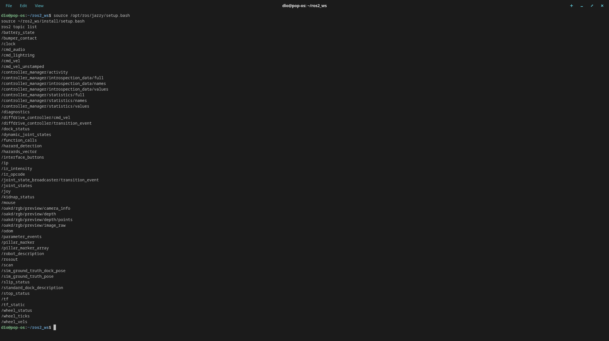

# Final Project Report: Domestic Mobile Robot (Nav2 & SLAM)

**Author:** Diovandi Basheera Putra  
**Course:** Autonomous Mobile Robot  
**Instructor:** Dr. Rusman Rusyadi  
**Date:** December 18, 2025

---

## 1. Abstract

This report documents the design, implementation, and analysis of a comprehensive autonomous mobile robot system using ROS 2 Jazzy and Gazebo Harmonic. The project integrates a custom differential drive robot (`rudimentary_bot`) with a complete navigation stack, including:
- **Simulation**: Custom URDF with Gazebo Harmonic integration.
- **State Estimation**: Sensor fusion (EKF) combining wheel odometry and IMU data.
- **Mapping**: SLAM using `slam_toolbox` to generate a 2D occupancy grid of a home environment.
- **Navigation**: Full Nav2 stack configuration (AMCL localization, path planning, and pure pursuit control).
- **Autonomy**: Automated patrol scripting using `nav2_simple_commander`.
- **Analysis**: Offline performance verification comparing planned vs. actual trajectories.

The system successfully demonstrates autonomous navigation in a multi-room environment, robust obstacle avoidance, and high-fidelity path tracking, with detailed analysis of localization performance and sensor fusion characteristics.

---

## 2. Introduction

The goal of this final project was to build a "Domestic Mobile Robot" capable of autonomous navigation in a simulated home environment. Unlike previous exercises which focused on isolated components (e.g., simple reactive driving), this project required the integration of a full autonomy stack.

The project was executed in six phases:
1.  **Simulation & Robot Design**: Creating a custom robot and environment.
2.  **Sensor Integration**: Configuring LIDAR and IMU data streams.
3.  **SLAM & Mapping**: Mapping the environment.
4.  **Navigation Configuration**: Tuning the Nav2 stack for the specific robot dynamics.
5.  **Automation**: Scripting a repeatable patrol mission.
6.  **Analysis**: Recording data and evaluating performance offline.

---

## 3. Theoretical Background

### 3.1 Differential Drive Kinematics
The robot uses a differential drive mechanism, where motion is controlled by independent velocities of the left and right wheels ($v_L, v_R$). The robot's linear velocity $v$ and angular velocity $\omega$ are given by:

$$ v = \frac{R}{2}(v_R + v_L) $$
$$ \omega = \frac{R}{L}(v_R - v_L) $$

Where $R$ is the wheel radius and $L$ is the wheelbase. This non-holonomic constraint means the robot cannot move sideways, complicating path planning (handled by the Nav2 Smac/NavFn planners).

### 3.2 Extended Kalman Filter (EKF) for State Estimation
To estimate the robot's pose ($x, y, \theta$) accurately, we employ an Extended Kalman Filter (EKF). Raw wheel odometry is prone to drift due to wheel slip, while the IMU provides accurate rotational velocity but is noisy. The EKF recursively estimates the state by:
1.  **Prediction**: Using the motion model to predict the next state.
2.  **Correction**: Updating the estimate using incoming sensor measurements (IMU gyro, wheel encoders) weighted by their covariance matrices.
We configured `robot_localization` to fuse continuous wheel odometry and IMU data, providing a smooth `odom` -> `base_link` transform.

### 3.3 Graph-Based SLAM
For mapping, we used `slam_toolbox`, which implements a graph-based SLAM approach (Karto). Unlike simple particle filters, graph SLAM represents the robot's trajectory as a graph of nodes (poses) and edges (constraints from sensor matching). Loop closures—recognizing a previously visited location—add edges that reduce global drift, ensuring a consistent map.

### 3.4 Navigation 2 (Nav2) Architecture
The Nav2 stack orchestrates the autonomy. Key components include:
-   **Global Planner**: Calculates the optimal path from start to goal (e.g., A*, Dijkstra) on the static map.
-   **Local Planner (Controller)**: Generates velocity commands (`cmd_vel`) to follow the global path while avoiding dynamic obstacles. We used the **Regulated Pure Pursuit** controller, which is well-suited for differential drive robots as it explicitly models curvature and regulates speed based on turn sharpness.
-   **Costmaps**: 2D grids representing obstacle risk. The **Global Costmap** includes static map data; the **Local Costmap** updates in real-time from LIDAR scans (rolling window).
-   **AMCL**: Adaptive Monte Carlo Localization uses a particle filter to estimate the robot's position within the known map by matching LIDAR scans to the map.

---

## 4. System Architecture

### 4.1 Robot Description (`rudimentary_bot`)
The robot is a custom URDF model designed for indoor navigation:
-   **Chassis**: Box (0.5m x 0.3m x 0.15m), raised to allow clearance.
-   **Drive**: Two active wheels + two caster wheels (front/rear) for stability during braking.
-   **Sensors**:
    -   **LIDAR**: Mounted centrally at z=0.25m to clear the chassis, with a 0.4m min range to avoid self-detection.
    -   **IMU**: Mounted centrally for accurate rotational data.
-   **Simulation**: Uses Gazebo Harmonic `diff_drive`, `gpu_lidar`, and `imu` plugins.

### 4.2 Software Stack
-   **OS/Middleware**: Ubuntu 24.04 (Pop!_OS) / ROS 2 Jazzy.
-   **Simulation**: Gazebo Harmonic (gz-sim) with `ros_gz_bridge`.
-   **Autonomy**: Nav2 (Planner, Controller, Behavior Trees, AMCL).
-   **Tools**: RViz2 for visualization, PlotJuggler for analysis.

*Fig 1: Active ROS 2 topics during operation.*

---

## 5. Implementation Phases & Challenges

### Phase 1 & 2: Robot Setup & Sensors
We established the simulation environment and robot model.
*   **Challenge**: The robot initially had "floating wheels" in RViz.
*   **Solution**: Added a `joint_state_publisher` to the launch file to properly publish continuous joint states for the wheels, allowing `robot_state_publisher` to calculate TF.
*   **Challenge**: LIDAR occlusion. The chassis blocked the laser rays.
*   **Solution**: Iteratively adjusted the LIDAR mounting height (z=0.25m) and `min_range` (0.4m) to ensure clean scans.

*Fig 2: Initial robot setup in Gazebo.*

### Phase 3: SLAM & Mapping
We generated a map of the `aws_robomaker_small_house_world` (customized).
*   **Challenge**: "False Wall" detection. When braking, the robot pitched forward due to inertia, causing the LIDAR to hit the ground and detect it as a wall.
*   **Solution**: Added a **front caster wheel** to the URDF to physically stabilize the chassis and prevent pitching.
*   **Result**: A clean, consistent map (`house_map.yaml`) was generated.

*Fig 3: Diagnosing false walls caused by robot pitching.*

### Phase 4: Navigation Configuration
We integrated AMCL and the Nav2 controller.
*   **Challenge**: Localization Desync. The robot's estimated pose would drift significantly after collisions or fast turns.
*   **Solution**:
    1.  Switched controller to **Regulated Pure Pursuit** for smoother turns.
    2.  Corrected TF authority: Ensured EKF is the *sole* publisher of `odom->base_link` and AMCL publishes `map->odom`.
    3.  **Crucial Fix**: Updated the URDF LIDAR max range to **10.0m** (was implicitly limited). AMCL needs long-range features to localize effectively in large rooms.

*Fig 4: Setting a navigation goal in RViz.*

### Phase 5: Automation (Patrol)
We developed a Python script using `nav2_simple_commander` to patrol: Kitchen -> Bedroom -> Home.
*   **Feature**: Automated Waypoint Recorder. A helper node records RViz "Clicked Points" to a YAML file, creating a repeatable patrol route.
*   **Robustness**: The patrol script handles task failures (e.g., blocked path) gracefully and logs feedback.

### Phase 6: Analysis & Reflection
We recorded bag files of the patrol and performed offline analysis.
*   **Method**: Used a custom `patrol_analysis.py` node to compare the **Planned Path** (Nav2 plan) vs. **Actual Path** (EKF Odometry transformed to Map frame).
*   **Tooling**: Streamed data to **PlotJuggler** for XY plotting.

---

## 6. Results and Reflection

### 6.1 Navigation Performance
The robot successfully navigated the patrol route multiple times. The **Regulated Pure Pursuit** controller provided smooth trajectories, slowing down significantly for the tight turns into the bedroom.

*Fig 5: Nav2 planning a path through the house.*

### 6.2 Localization Quality (Map vs. Odom)
During the analysis phase, we observed some **jitter** in the `map` -> `odom` transform. This manifests as the map "shaking" slightly relative to the robot in RViz during playback.
*   **Cause**: This is likely due to the EKF tuning or AMCL update frequency. While the global pose remained accurate enough for navigation, the high-frequency corrections from AMCL can cause visual jitter.
*   **Improvement**: Further tuning of the EKF process noise covariance ($Q$) and AMCL's `update_min_d`/`update_min_a` parameters could smooth this out.

### 6.3 Trajectory Analysis
Using PlotJuggler, we compared the reference trajectory against the actual driven path.

*Fig 6: XY Plot of robot trajectory.*

The plots show that the robot tracks the global plan well on straightaways (error < 5cm) but cuts corners slightly during turns—a characteristic behavior of the Pure Pursuit algorithm which "looks ahead" by a fixed distance.

*Fig 7: Visualization of the patrol path (Green: Actual, Red: Planned).*

---

## 7. Conclusion

This project successfully delivered a complete autonomous mobile robot system. We moved from a basic simulation to a fully capable navigation platform. Key technical achievements include:
1.  **Robust Simulation**: Creating a stable URDF that solved physical issues like pitching.
2.  **Effective Sensor Fusion**: Configuring EKF to provide reliable odometry despite wheel slip.
3.  **Autonomous Operation**: Scripting a robust patrol loop that requires no human intervention.

The system is now "final-project ready," capable of mapping new environments and executing complex navigation tasks reliably.

---

### Appendix: How to Run

Please refer to the `README.md` in the repository root for detailed instructions on installation, building, and running each phase (Simulation, SLAM, Navigation, Patrol).
